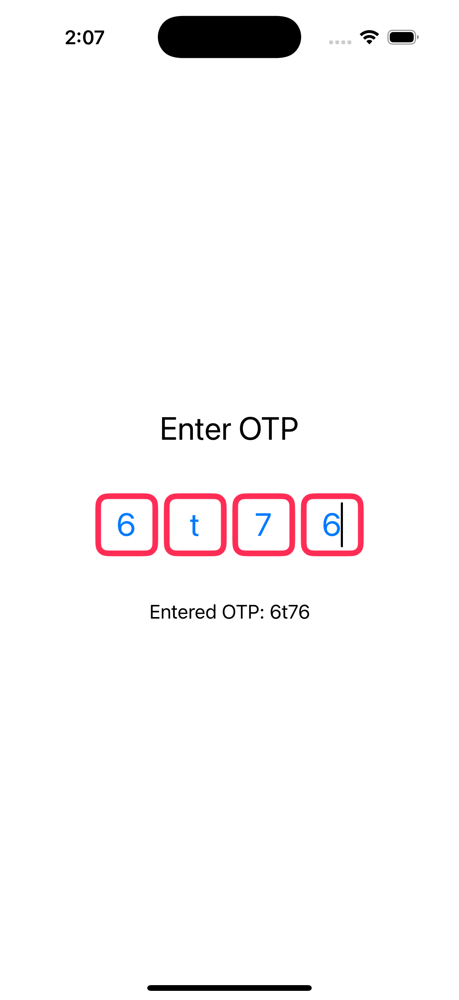
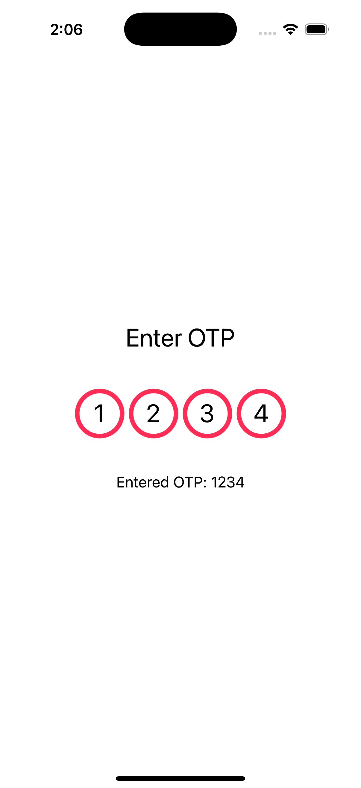
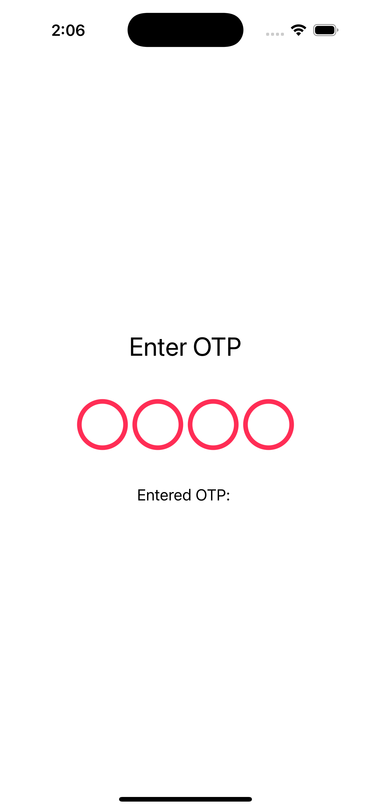

# MGOTPKit 🧑‍💻💳

Welcome to **MGOTPKit**! 🎉 A customizable OTP (One-Time Password) verification component for iOS built with SwiftUI and UIKit.

---

## Features 🚀

- **Customizable OTP Fields**: Adjust the number of digits, spacing, borders, text color, background color, corner radius, and more!
- **UIKit and SwiftUI Support**: Compatible with both SwiftUI and UIKit, so you can integrate it seamlessly into your app.
- **Shape Customization**: Use different shapes for the OTP field such as `roundedRectangle`, `circle`, and `capsule` 🎨.
- **Focus Management**: Automatic focus switching between fields while typing 🔀.
- **Animation**: Add smooth animation for OTP field transitions 🏃‍♀️💨.
- **Completion Handler**: Get notified when the user has entered all OTP digits with a completion callback 🔔.

---

## Screenshots 📸

Here’s how **MGOTPKit** will look in your app!





---

## Installation 📦

You can install **MGOTPKit** via [Swift Package Manager](https://developer.apple.com/documentation/xcode/adding-package-dependencies-to-your-app).

### Swift Package Manager

1. In Xcode, go to `File` > `Swift Packages` > `Add Package Dependency...`
2. Enter the repository URL:
   ```bash
   https://github.com/your-username/MGOTPKit.git
