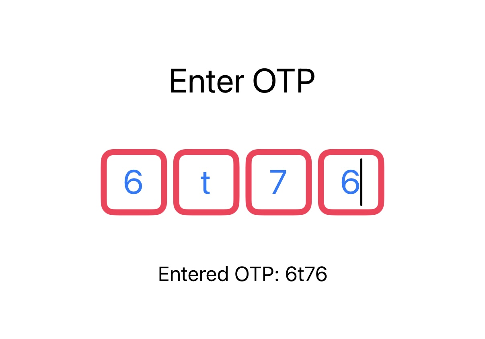
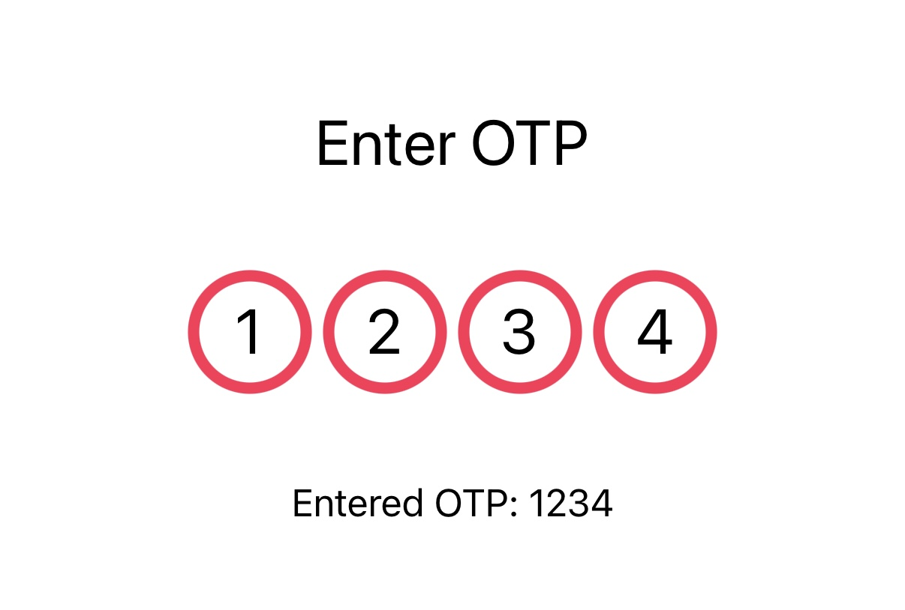
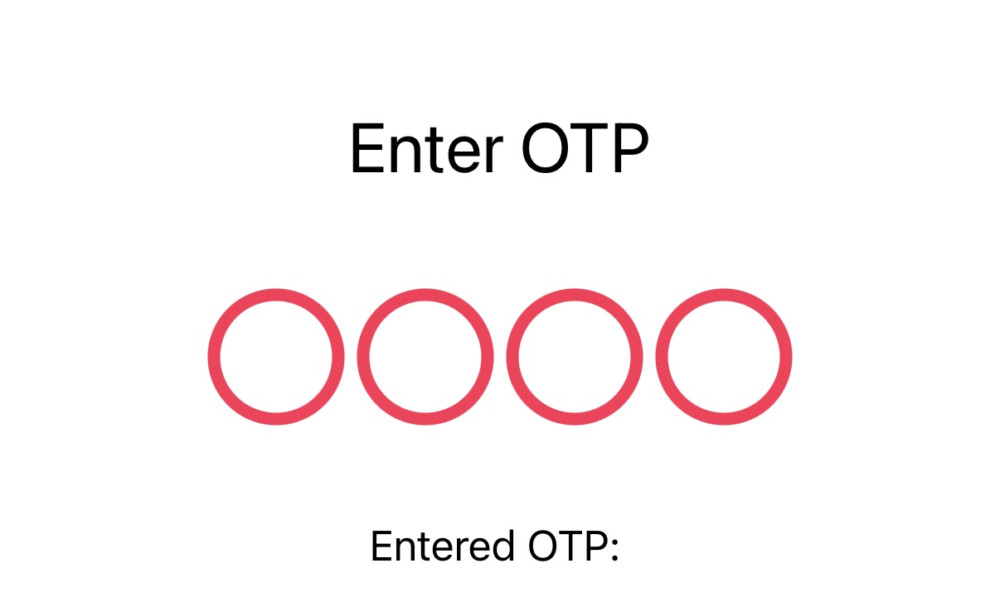

# MGOTPKit 🧑‍💻💳

Welcome to **MGOTPKit**! 🎉 A customizable OTP (One-Time Password) verification component for iOS built with SwiftUI and UIKit.

---

## Features 🚀

- **Customizable OTP Fields**: Adjust the number of digits, spacing, borders, text color, background color, corner radius, and more!
- **UIKit and SwiftUI Support**: Compatible with both SwiftUI and UIKit, so you can integrate it seamlessly into your app.
- **Shape Customization**: Use different shapes for the OTP field such as `roundedRectangle`, `circle`, and `capsule` 🎨.
- **Focus Management**: Automatic focus switching between fields while typing 🔀.
- **Animation**: Add smooth animation for OTP field transitions 🏃‍♀️💨.
- **Completion Handler**: Get notified when the user has entered all OTP digits with a completion callback 🔔.

---

## Screenshots 📸

Here’s how **MGOTPKit** will look in your app!





---

## Installation 📦

You can easily install **MGOTPKit** into your iOS project using [Swift Package Manager](https://developer.apple.com/documentation/xcode/adding-package-dependencies-to-your-app).

### Swift Package Manager

1. Open your project in Xcode.
2. Navigate to `File` > `Swift Packages` > `Add Package Dependency...`.
3. Paste the repository URL:
   ```bash
   https://github.com/mohamedgamal0/MGOTPKit.git

- **Numbered Steps**: Provide a clear, step-by-step guide for installation.
- **Code Block**: Use triple backticks (` ``` `) to format code or URLs.

---

### 5. **Usage Guide**
This is the main section of the README where you explain how to use the package. Include code examples for both **SwiftUI** and **UIKit**.

### SwiftUI Example 📱

In **SwiftUI**, you can integrate the OTP component like this:

```swift
import MGOTPKit
import SwiftUI

struct ContentView: View {
    @State private var otp = ""

    var body: some View {
        VStack {
            Text("Enter OTP")
                .font(.headline)
            
            OTPVerificationView(
                digitCount: 6,                            // Number of OTP digits
                spacing: 10,                              // Spacing between fields
                borderColor: .blue,                       // Border color
                borderWidth: 2,                          // Border width
                textColor: .black,                        // Text color
                font: .system(size: 20),                  // Font style
                backgroundColor: .white,                 // Background color
                cornerRadius: 10,                         // Corner radius
                fieldSize: CGSize(width: 50, height: 50), // Size of each field
                animationDuration: 0.3,                   // Animation speed
                cursorColor: .blue,                      // Cursor color
                shapeType: .roundedRectangle(cornerRadius: 10), // Shape type
                onCompletion: { otp in
                    self.otp = otp
                    print("OTP entered: \(otp)")        // OTP entered by the user
                }
            )
            .padding()
        }
        .padding()
    }
}
```
### UIKit Example 📱

For **UIKit** users, the process is equally easy:

```swift
import MGOTPKit
import UIKit

class ViewController: UIViewController {
    var otpFieldView: OTPVerificationView!

    override func viewDidLoad() {
        super.viewDidLoad()

        otpFieldView = OTPVerificationView(
            digitCount: 6,                            // Number of OTP digits
            spacing: 10,                              // Spacing between fields
            borderColor: .blue,                       // Border color
            borderWidth: 2,                          // Border width
            textColor: .black,                        // Text color
            font: .system(size: 20),                  // Font style
            backgroundColor: .white,                 // Background color
            cornerRadius: 10,                         // Corner radius
            fieldSize: CGSize(width: 50, height: 50), // Size of each field
            animationDuration: 0.3,                   // Animation speed
            cursorColor: .blue,                      // Cursor color
            shapeType: .roundedRectangle(cornerRadius: 10), // Shape type
            onCompletion: { otp in
                print("OTP entered: \(otp)")         // OTP entered by the user
            }
        )
        
        otpFieldView.translatesAutoresizingMaskIntoConstraints = false
        view.addSubview(otpFieldView)
        
        NSLayoutConstraint.activate([
            otpFieldView.centerXAnchor.constraint(equalTo: view.centerXAnchor),
            otpFieldView.centerYAnchor.constraint(equalTo: view.centerYAnchor)
        ])
    }
}
```

## Contributing 🧑‍💻

We welcome contributions! If you find any issues or have suggestions for improvements, feel free to open an issue or submit a pull request. Together, we can make **MGOTPKit** even better! 🚀

## License 📄

**MGOTPKit** is available under the MIT license.

Copyright (c) 2024 Mohamed Gamal

Permission is hereby granted, free of charge, to any person obtaining a copy
of this software and associated documentation files (the "Software"), to deal
in the Software without restriction, including without limitation the rights
to use, copy, modify, merge, publish, distribute, sublicense, and/or sell
copies of the Software, and to permit persons to whom the Software is
furnished to do so, subject to the following conditions:

The above copyright notice and this permission notice shall be included in all
copies or substantial portions of the Software.

THE SOFTWARE IS PROVIDED "AS IS", WITHOUT WARRANTY OF ANY KIND, EXPRESS OR
IMPLIED, INCLUDING BUT NOT LIMITED TO THE WARRANTIES OF MERCHANTABILITY,
FITNESS FOR A PARTICULAR PURPOSE AND NONINFRINGEMENT. IN NO EVENT SHALL THE
AUTHORS OR COPYRIGHT HOLDERS BE LIABLE FOR ANY CLAIM, DAMAGES OR OTHER
LIABILITY, WHETHER IN AN ACTION OF CONTRACT, TORT OR OTHERWISE, ARISING FROM,
OUT OF OR IN CONNECTION WITH THE SOFTWARE OR THE USE OR OTHER DEALINGS IN THE
SOFTWARE.
